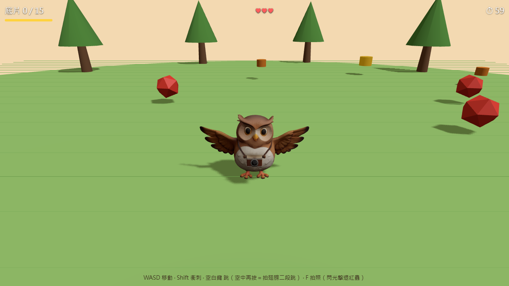
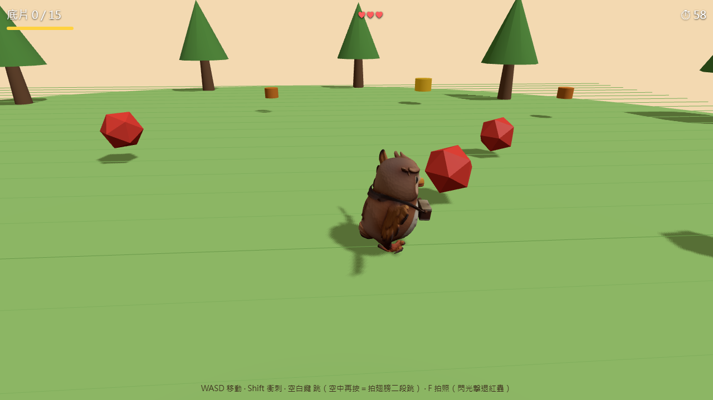
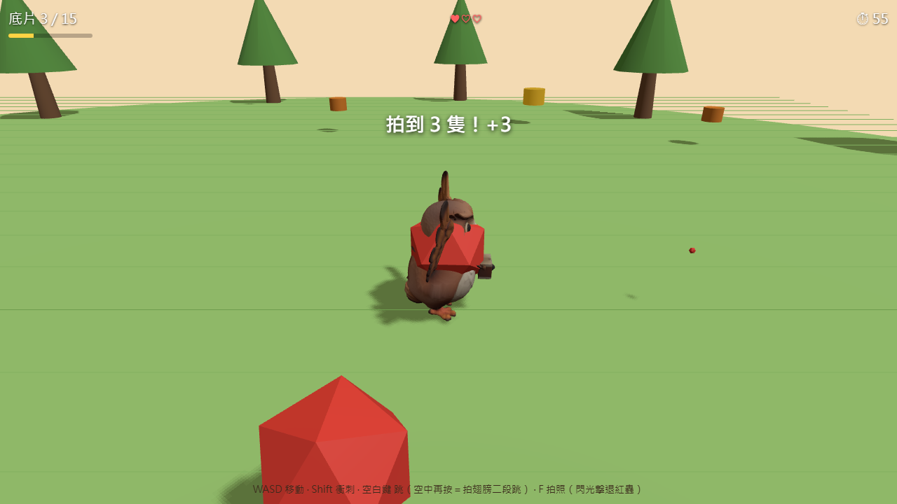
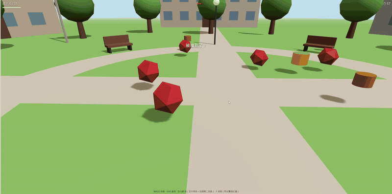

# 小光 · 社團吉祥物（圖 → 3D → Blender → 遊戲）

**小光**是攝影社的吉祥物：一隻抱著相機、圓滾滾的貓頭鷹。
這個專案記錄了從一張概念圖，到可在瀏覽器遊玩的 3D 小遊戲的完整流程，並用 Claude Code + Blender MCP 完成模型清理。

<p align="center">
  
  
  
</p>

<p align="center">
  
</p>

## 流程

```text
文字設定 → 概念圖 → 圖生3D → Blender 清理(MCP) → 綁骨+動畫 → Three.js 遊戲 → Playwright 試玩
```

詳細的交接規格與驗收狀態見 [PIPELINE.md](PIPELINE.md)，過程中遇到的問題與解法見 [handoff-log.md](handoff-log.md)。

## 快速開始

需要 [Node.js](https://nodejs.org/)。

**Windows：** 直接雙擊 `start-game.bat`（第一次會自動安裝套件並開啟瀏覽器）。

**或手動執行：**

```bash
cd game
npm install
npm run dev      # 開發
npm run build    # 打包到 game/dist/
```

## 玩法

60 秒內收集 15 個底片（金色底片 +3）。紅蟲會追著你，被撞到扣 1 顆心（共 3 顆），體力歸零或時間到就失敗。

| 操作 | 按鍵 |
|---|---|
| 移動 | WASD／方向鍵 |
| 衝刺 | Shift |
| 跳／二段跳 | 空白鍵（空中再按一次） |
| 拍照（閃光擊退 7 m 內的紅蟲） | F |
| 重玩 | R 或點一下結束畫面 |

手機：左下搖桿、右下「跳」「拍」按鈕。

## 專案結構

| 路徑 | 內容 |
|---|---|
| `concept/` | 概念圖（正／側／背） |
| `assets/` | 各階段 GLB：`mascot_raw`（原始）→ `mascot_clean`（清理）→ `mascot_rigged`（綁骨）→ `mascot`（遊戲用） |
| `blender-scripts/` | Blender MCP 外掛 |
| `game/` | Three.js + Vite 小遊戲 |
| `renders/` | 各階段驗收截圖 |
| `PIPELINE.md` | 交接物規格與驗收清單 |
| `handoff-log.md` | 每個交接處的問題與解法 |

## 模型製作

1. 概念圖（正面）
2. [TRELLIS](https://huggingface.co/spaces/trellis-community/TRELLIS)（Hugging Face，單張正面圖）生成原始 3D
3. Blender 5.2 + Blender MCP 清理：高 1.0 m、原點在腳底中央、約 1 萬面
4. 手動建立 7 根骨頭並分配權重，自製 idle / walk / jump 動畫
5. 匯出 GLB，交給 Three.js

## 已知問題

- 背面是 AI 推測生成的，有些微凹痕與貼圖瑕疵（備份：`assets/mascot_clean_v1_backpatch.glb`）
- 手機載入速度尚未實測

## 技術

Three.js · Vite · Blender 5.2 · Blender MCP · Claude Code · Playwright
